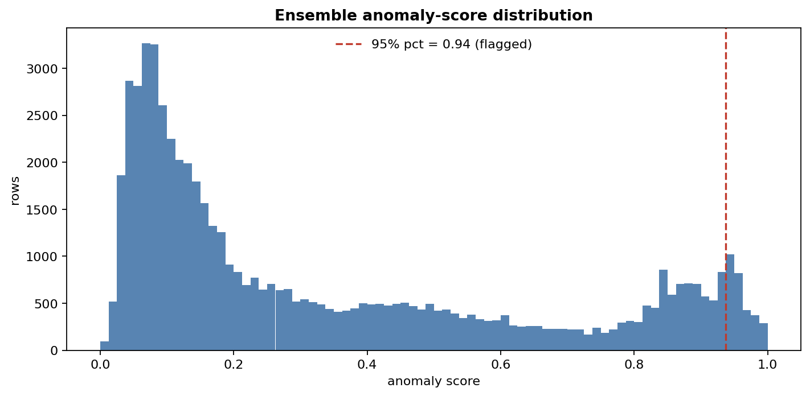
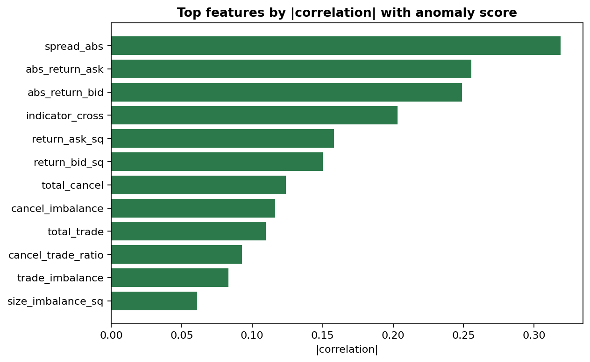

# Detecting Market Manipulation in Limit Order Books

Unsupervised anomaly detection on high-frequency limit-order-book data — flagging
spoofing, layering, and momentum-ignition events without labels. Built for the
Kaggle competition [*HFT Anomalies: Detecting Market Manipulation in LOB*](https://www.kaggle.com/competitions/high-frequency-trading-anomalies-detecting-market-manipulation-in-lob).



## The problem

There are no manipulation labels at train time — you only see millions of order-book
events and have to score each one by how likely it is to be manipulative. So this is
a one-class problem: learn what *normal* order flow looks like, then rank everything
by deviation. The output is a per-row anomaly score (`ID, TARGET`).

## Approach

**Features** (`src/features.py`). Manipulation hides in imbalances and interactions,
not raw columns, so I engineer 27 cross-sectional features — depth/trade/cancel
imbalances, the cancel-to-trade ratio (the classic spoofing tell), return×flow
interactions, non-linear terms — plus per-instrument rolling windows for the
sequence-aware models.

**Scorers** (`src/models.py`), deliberately diverse so the ensemble sees different
kinds of "weird":

| Model | What it flags |
|---|---|
| Isolation Forest | points that isolate in few random splits |
| ECOD | tail mass under each feature's empirical CDF (strongest single model) |
| ECOD per symbol | same, scaled per instrument so quiet and busy names are comparable |
| Autoencoder (PyTorch) | high reconstruction error vs. normal rows |

Each scorer is normalised against the **training** distribution, then combined by
**rank-averaging** — robust to the different score scales, only the ordering counts.



On a held-out sample the Isolation-Forest and ECOD rankings correlate ~0.93 yet
disagree enough on the tails for the ensemble to add value; the score distribution
is sharply right-skewed, with the manipulative tail isolated above the 95th
percentile.

## The math

**Isolation Forest** scores a point by how few random axis-aligned splits isolate
it. With $E[h(x)]$ the mean isolation depth over trees and $c(n)$ the expected depth
of an unsuccessful BST search (the normaliser),

$$s(x, n) = 2^{-E[h(x)]/c(n)}, \qquad c(n) = 2H(n-1) - \tfrac{2(n-1)}{n}$$

so $s \to 1$ for points that isolate almost immediately — anomalies.

**ECOD** is distribution-free: estimate each feature's empirical CDF $\hat F_j$ and
aggregate per-dimension log tail probabilities,

$$O(x) = -\sum_j \log\Big(\min\big(\hat F_j(x_j),\, 1 - \hat F_j(x_j)\big)\Big)$$

(with a skew correction choosing the relevant tail per feature). No hyper-parameters,
$O(d\,n\log n)$, and the strongest single scorer here.

**Autoencoder** learns the manifold of normal rows; the score is reconstruction
error $\lVert x - g(f(x)) \rVert^2$ — manipulation doesn't reconstruct well from a
code optimised for normal flow.

**Ensemble.** Scores live on incompatible scales, so each is either squashed through
a sigmoid centred on its *training* mean/std or converted to ranks; the final score
is a rank average, $\frac{1}{Mn}\sum_m \text{rank}_m(x)$ — only ordering survives,
which is exactly what an AUC-style metric rewards.

## References

- Liu, F.T., Ting, K.M. & Zhou, Z.-H. (2008), *Isolation Forest*, ICDM.
- Li, Z., Zhao, Y., et al. (2022), *ECOD: Unsupervised Outlier Detection Using Empirical Cumulative Distribution Functions*, IEEE TKDE.
- Sakurada, M. & Yairi, T. (2014), *Anomaly Detection Using Autoencoders with Nonlinear Dimensionality Reduction*, MLSDA.
- Cartea, Á., Jaimungal, S. & Wang, Y. (2020), *Spoofing and Price Manipulation in Order-Driven Markets*, Applied Mathematical Finance — why cancel-flow imbalance is the tell.

## Project structure

```
lob-market-manipulation-detection/
├── src/
│   ├── features.py     # 27 cross-sectional + 13 temporal LOB features
│   ├── models.py       # IF / ECOD / per-symbol ECOD / autoencoder + ensemble
│   ├── pipeline.py     # `prepare` and `run` entry points
│   └── viz.py          # score + feature diagnostics
├── notebooks/          # full experiment trail (01 data prep … 11 ensembles)
├── configs/config.yaml # features, model hyper-params, ensemble weights
├── reports/figures/    # generated diagnostics
└── pyproject.toml      # uv-managed
```

## Setup & run

```bash
uv sync                                   # create the env

# 1. get the data (Kaggle CLI) into data/raw/, then build features:
kaggle competitions download -c high-frequency-trading-anomalies-detecting-market-manipulation-in-lob -p data/raw
unzip 'data/raw/*.zip' -d data/raw
uv run python -m src.pipeline prepare

# 2. score, ensemble, write submission + figures:
uv run python -m src.pipeline run                     # full test set
uv run python -m src.pipeline run --sample 60000      # quick sample
uv run python -m src.pipeline run --with-autoencoder  # add the torch scorer
```

Output: `outputs/submissions/submission_pipeline.csv` plus diagnostics in
`reports/figures/`.

## Notes

- The 11 notebooks document the path that got to the final model — isolation forest,
  ECOD, the autoencoder, temporal ECOD, a contrastive sequence model (CTST), and the
  rank-average ensembles. `src/pipeline.py` packages the practical core; the notebooks
  keep the experiments reproducible.
- Raw data and the large per-experiment submission CSVs are git-ignored; the pipeline
  regenerates them.
- The autoencoder auto-selects CUDA → Apple MPS → CPU, and torch is imported lazily,
  so the IF/ECOD path runs without it.
